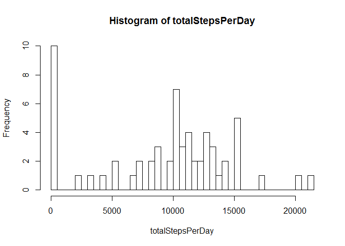
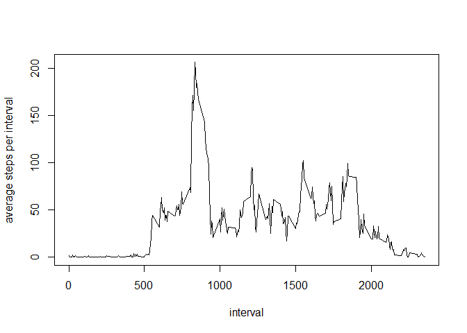
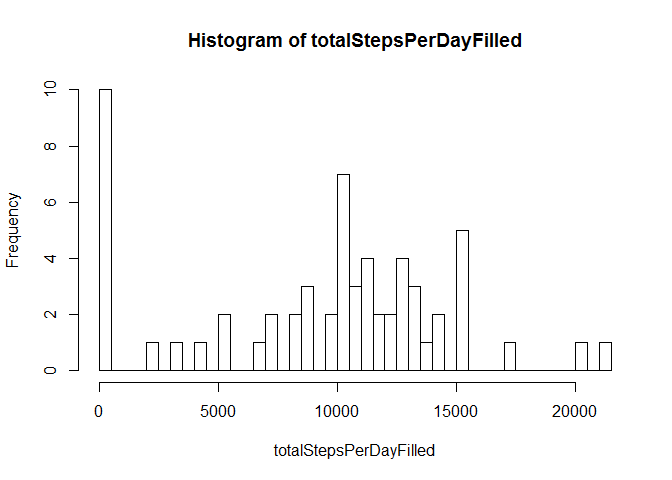
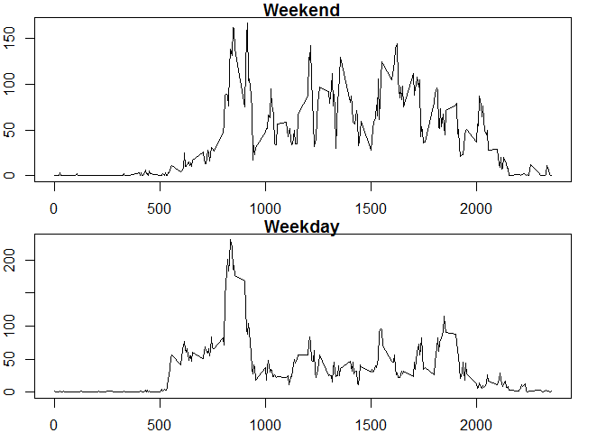

# Reproducible Research: Peer Assessment 1


## Loading and preprocessing the data

The code below reads the activity monitoring data:


```r
data <- read.csv("activity.csv")
```


## What is mean total number of steps taken per day?

The code below retrieves the total number of steps taken per day


```r
totalStepsPerDay <- tapply(data$steps, data$date, sum, na.rm=TRUE)
```

The results are as follows:

```
##            totalStepsPerDay
## 2012-10-01                0
## 2012-10-02              126
## 2012-10-03            11352
## 2012-10-04            12116
## 2012-10-05            13294
## 2012-10-06            15420
## 2012-10-07            11015
## 2012-10-08                0
## 2012-10-09            12811
## 2012-10-10             9900
## 2012-10-11            10304
## 2012-10-12            17382
## 2012-10-13            12426
## 2012-10-14            15098
## 2012-10-15            10139
## 2012-10-16            15084
## 2012-10-17            13452
## 2012-10-18            10056
## 2012-10-19            11829
## 2012-10-20            10395
## 2012-10-21             8821
## 2012-10-22            13460
## 2012-10-23             8918
## 2012-10-24             8355
## 2012-10-25             2492
## 2012-10-26             6778
## 2012-10-27            10119
## 2012-10-28            11458
## 2012-10-29             5018
## 2012-10-30             9819
## 2012-10-31            15414
## 2012-11-01                0
## 2012-11-02            10600
## 2012-11-03            10571
## 2012-11-04                0
## 2012-11-05            10439
## 2012-11-06             8334
## 2012-11-07            12883
## 2012-11-08             3219
## 2012-11-09                0
## 2012-11-10                0
## 2012-11-11            12608
## 2012-11-12            10765
## 2012-11-13             7336
## 2012-11-14                0
## 2012-11-15               41
## 2012-11-16             5441
## 2012-11-17            14339
## 2012-11-18            15110
## 2012-11-19             8841
## 2012-11-20             4472
## 2012-11-21            12787
## 2012-11-22            20427
## 2012-11-23            21194
## 2012-11-24            14478
## 2012-11-25            11834
## 2012-11-26            11162
## 2012-11-27            13646
## 2012-11-28            10183
## 2012-11-29             7047
## 2012-11-30                0
```

Below is a histogram for the total number of steps per day.


```r
hist(totalStepsPerDay, breaks=60)
```

 

Below is the code and results for computing the mean of the total number of steps per day.


```r
mean(totalStepsPerDay)
```

```
## [1] 9354.23
```

Below is the code and results for computing the median of the total number of steps per day.


```r
median(totalStepsPerDay)
```

```
## [1] 10395
```

## What is the average daily activity pattern?

The code and results below show the average number of steps taken per 5 minute interval across all days. 


```r
aveDailyActPattern <- tapply(data$steps, data$interval, mean, na.rm=TRUE)
aveDailyActPatternTable <- data.frame(as.numeric(aveDailyActPattern), as.numeric(names(aveDailyActPattern)))
plot(aveDailyActPatternTable[,2], aveDailyActPatternTable[,1], type="l", xlab="interval", ylab="average steps per interval")
```

 

The code and results below shows the 5 minute interval containing the maximum average number of steps.


```r
aveDailyActPatternTable[,2][aveDailyActPatternTable[,1] == max(aveDailyActPatternTable[,1], na.rm=TRUE)]
```

```
## [1] 835
```

## Inputing missing values

The code and results below correspond to the number of NAs in the data.

```r
nrow(data[is.na(data$steps),])
```

To prevent bias in calculations, the code below replaces the missing values with the average steps for the specific 5 minute interval. The new data frame "dataFilled" without missing values is produced.


```r
dataFilled <- data
dataFilled$steps[is.na(dataFilled$steps)] <- aveDailyActPatternTable[,1][match(aveDailyActPatternTable[,2],dataFilled$interval)]
```

The code below computes the total steps per day based on the new data frame without missing values


```r
totalStepsPerDayFilled <- tapply(data$steps, data$date, sum, na.rm=TRUE)
as.data.frame(totalStepsPerDayFilled)
```

```
##            totalStepsPerDayFilled
## 2012-10-01                      0
## 2012-10-02                    126
## 2012-10-03                  11352
## 2012-10-04                  12116
## 2012-10-05                  13294
## 2012-10-06                  15420
## 2012-10-07                  11015
## 2012-10-08                      0
## 2012-10-09                  12811
## 2012-10-10                   9900
## 2012-10-11                  10304
## 2012-10-12                  17382
## 2012-10-13                  12426
## 2012-10-14                  15098
## 2012-10-15                  10139
## 2012-10-16                  15084
## 2012-10-17                  13452
## 2012-10-18                  10056
## 2012-10-19                  11829
## 2012-10-20                  10395
## 2012-10-21                   8821
## 2012-10-22                  13460
## 2012-10-23                   8918
## 2012-10-24                   8355
## 2012-10-25                   2492
## 2012-10-26                   6778
## 2012-10-27                  10119
## 2012-10-28                  11458
## 2012-10-29                   5018
## 2012-10-30                   9819
## 2012-10-31                  15414
## 2012-11-01                      0
## 2012-11-02                  10600
## 2012-11-03                  10571
## 2012-11-04                      0
## 2012-11-05                  10439
## 2012-11-06                   8334
## 2012-11-07                  12883
## 2012-11-08                   3219
## 2012-11-09                      0
## 2012-11-10                      0
## 2012-11-11                  12608
## 2012-11-12                  10765
## 2012-11-13                   7336
## 2012-11-14                      0
## 2012-11-15                     41
## 2012-11-16                   5441
## 2012-11-17                  14339
## 2012-11-18                  15110
## 2012-11-19                   8841
## 2012-11-20                   4472
## 2012-11-21                  12787
## 2012-11-22                  20427
## 2012-11-23                  21194
## 2012-11-24                  14478
## 2012-11-25                  11834
## 2012-11-26                  11162
## 2012-11-27                  13646
## 2012-11-28                  10183
## 2012-11-29                   7047
## 2012-11-30                      0
```

Below is a histogram for the total number of steps per day for the new data set without missing values.


```r
hist(totalStepsPerDayFilled, breaks=60)
```

 

Below is the code and results for computing the mean of the total number of steps per day for the new data set without missing values.


```r
mean(totalStepsPerDayFilled)
```

```
## [1] 9354.23
```

Below is the code and results for computing the median of the total number of steps per day for the new data set without missing values.


```r
median(totalStepsPerDayFilled)
```

```
## [1] 10395
```

Since the mean was used to fill up the missing values, we are not expecting any changes with the graph and summary statistics from the original data.

## Are there differences in activity patterns between weekdays and weekends?

The code below adds a factor indicating whether the date is a weekend or a weekday.


```r
dataFilled[,4] <- ifelse(weekdays(as.Date(dataFilled[,2]))=="Saturday" | weekdays(as.Date(dataFilled[,2]))=="Sunday", "weekend", "weekday")
dataFilled[,4] <- as.factor(dataFilled[,4])
```

Below is the code and the generated time series plot of the 5-minute interval (x-axis) and the average number of steps taken, averaged across all weekday days or weekend days (y-axis)


```r
aveDailyActPatternWithDays <- tapply(dataFilled$steps, dataFilled[,c(3:4)], mean, na.rm=TRUE)
z <- cbind(as.numeric(rownames(aveDailyActPatternWithDays)), aveDailyActPatternWithDays[,1], aveDailyActPatternWithDays[,2])
par(mfrow=c(2,1))
par(mar=c(2,2,1,2))
plot(x = z[,1], y = z[,3], type="l", xlab = "", ylab = "", main="Weekend")
plot(x = z[,1], y = z[,2], type="l", xlab = "", ylab = "", main="Weekday")
```

 
